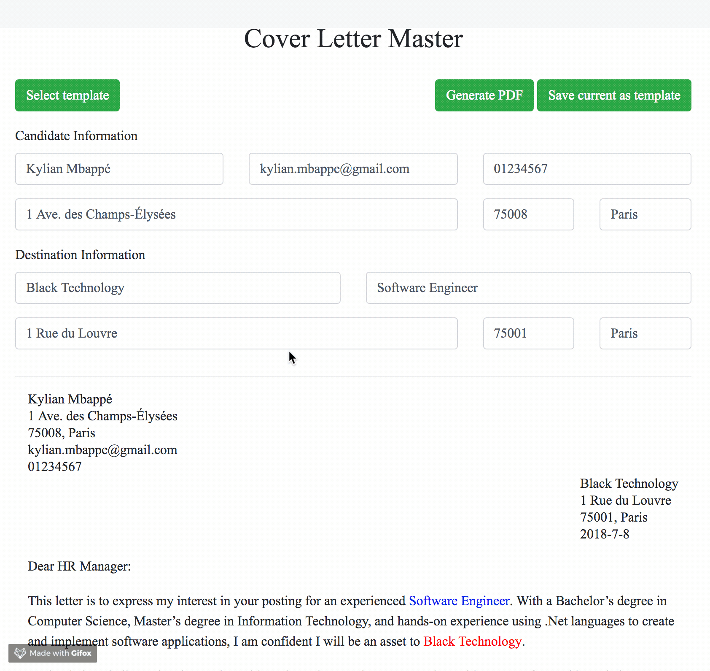
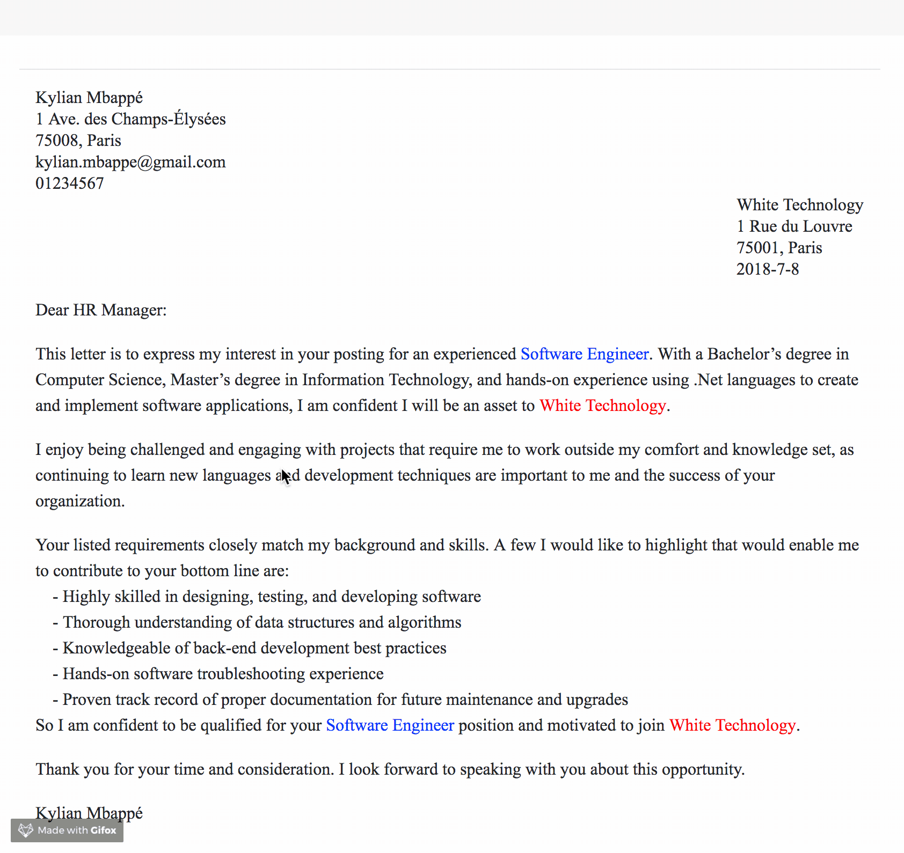

# cover-letter-master

Are you getting crazy writing dozens of cover letters to different companies for similar positions, modifying every details with 200% attention to avoid mistake, searching and formatting repeatedly ? Let the cover-letter-master take care of all those stuff! 

## installation

Extremely easy to use: just clone this project and open the `cover-letter-master.html` in any one of the popular browser (chrome, safari ...).

Cover letter templates are suggested to save in the ./templates folder.

The compatibility of different browser is not sufficiently tested. Bug report welcomed: maofeng1709@gmail.com.

## features

- Automatically generate cover letter header given the necessary candidate/destination information.
- Automatically detect and replace destination/title in cover letter content.
- Template loading and saving.
- Cover letter generating (PDF).

## demo

## things to do

- more delicate clean_ref
- extent to server/client model